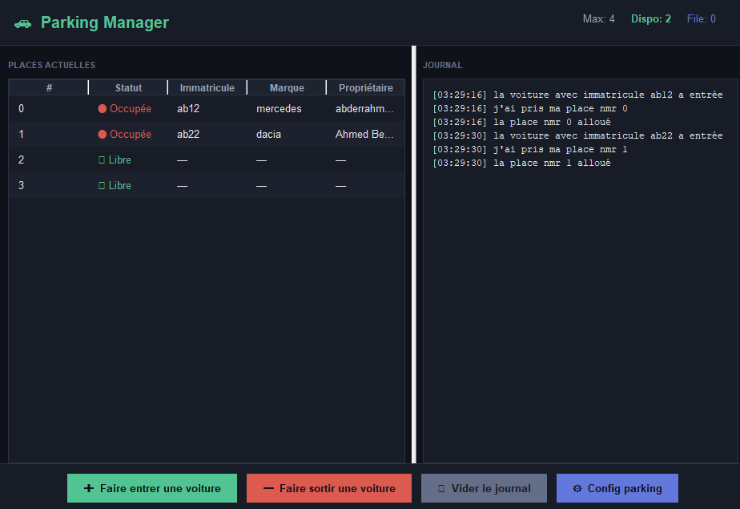

# 🚗 Parking Management System

Application Java de gestion de parking avec interface graphique Swing dark mode.

## 📸 image de l'interface

## ✨ Fonctionnalités

- Entrée et sortie de voitures avec formulaire
- Calcul automatique du tarif selon la durée (DH/heure)
- File d'attente automatique si le parking est plein
- Sortie automatique via threads (simulation)
- Journal d'activité en temps réel avec horodatage
- Export des transactions en fichier CSV
- Configuration dynamique (nombre de places, prix/heure)
- Interface dark mode moderne

## 🏗️ Architecture
src/  
├── app/        → Interface graphique (Swing)  
├── model/      → Logique métier (Parking, Voiture, Place)  
├── threads/    → Gestion des threads et export CSV  
└── data/       → Fichier transactions.csv

## 🛠️ Technologies

- Java (Swing, Collections Framework, Threads)
- `ArrayList`, `HashMap`, `Queue` pour la gestion des données
- `LocalDateTime` / `Duration` pour le calcul de durée
- `synchronized` pour la gestion de la concurrence

## 🚀 Lancement

1. Cloner le repo
2. Ouvrir dans IntelliJ IDEA
3. Compiler et exécuter `app.parkingGUI`

## 📚 Contexte

Projet académique — 1ère année cycle ingénieur, spécialité Logiciel et systèmes intelligents 
FSTT — Semestre 2